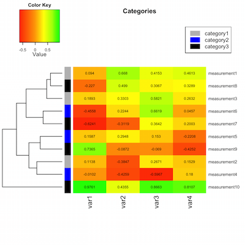

# Exploring data with ggplot2

## Classic plots vs ggplot { .build }
  
### `plot`, `barplot`, `hist`
  
- One function per plot style
- Limited ability to modify the plot (eg colours) depending on plot type
- Inconsistent data requirements (eg matrix vs data frame, tall vs wide)


### `ggplot2`

- One package many, many, many plot styles
- Many aspects of plot appearance can be made to depend on the data
- Data should generally be tall rather than wide. Use `melt` and `cast` to transform.


## Grammar of Graphics { .build }

ggplot is an implementation of the [grammar of graphics](http://vita.had.co.nz/papers/layered-grammar.pdf)

>- Data
>- Geometric objects (points, lines, areas)
>- Aesthetic mappings between data and objects
>- Statistical transformations (binning, aggregating)
>- Coordinate system
>- Scales (map data to aesthetic attributes)
>- Annotations (title, legend etc)
>- Faceting (representing data across multiple plots)

## Layers in ggplot {.build}

Each layer in ggplot has at least `data`, `geom` (geometric object), `stat` (statistical transform) and `aes` (aesthetic)

The `ggplot` function sets up a plot's baseline defaults

```{r,eval=FALSE}
p<-ggplot(data,aes(x=someval,y=someval))
```

Add layers with the `+` operator

```{r,eval=FALSE}
p+geom_point()
```

This layers inherits `data` and `aes` from the base plot and has a default `stat`

## A simple scatterplot {.build}


```{r,eval=FALSE}
library(ggplot2)
data(diamonds)
### <b>
p<-ggplot(diamonds)
p+geom_point(aes(x=carat,y=price))
### </b>
```

```{r, echo=FALSE}
library(ggplot2)
data(diamonds)
### <b>
ggplot(diamonds)+geom_point(aes(x=carat,y=price))
### </b>
```

## Add another aesthetic mapping {.build}

```{r, eval=FALSE}
p<-ggplot(diamonds)
### <b>
p+geom_point(aes(x=carat,y=price,color=clarity))
### </b>
```

```{r, echo=FALSE}
library(ggplot2)
data(diamonds)
ggplot(diamonds,aes(x=carat,y=price))+geom_point(aes(color=clarity))
```

## Available aesthetics {.build}

Aesthetics for `geom_point` are;

- x
- y
- alpha
- colour
- fill
- shape
- size

Find available aesthetics at [http://docs.ggplot2.org/current/](http://docs.ggplot2.org/current/). 

<div class="notes">
Aesthetics map properties of geometric object object (`geom`) to the data. Each `geom` has a different set of available properties. 
</div>


## Adding another layer {.build}

<div class="notes">
Each layer in ggplot has its own `data`,`aes`,`geom` and `stat`. These are all required, but ggplot has a hierarchical defaults system which means that in practice they are often inferred. 
</div>

```{r, eval=FALSE}
p<-ggplot(diamonds,aes(x=carat,y=price))
p+geom_point(aes(color=clarity))
### <b>
p+geom_smooth()
### </b>
```

```{r, echo=FALSE}
library(ggplot2)
data(diamonds)
ggplot(data=diamonds,aes(x=carat,y=price))+geom_point(aes(color=clarity))+stat_smooth(method="gam",formula=y ~ s(x, bs = "cs"))
```

## geom and stat objects are often complementary {.build}

For example `geom_smooth()` has `stat_smooth()` as its default `stat`

A `stat` adds new columns to the data that are used by the geom. For example `stat_smooth()` creates;

- `y` predicted value
- `ymin` lower pointwise confidence interval around the mean
- `ymax` upper pointwise confidence interval around the mean
- `se` standard error

These can all be accessed for aesthetic mapping if needed.

## Another `stat` , `geom` example {.build}

```{r, eval=FALSE}
p <- ggplot(data=diamonds,aes(x=price))
### <b>
p <- p + stat_bin(aes(y = ..count..))
### </b>
```

```{r, echo=FALSE}
ggplot(data=diamonds,aes(x=price)) + stat_bin(aes(y = ..count..), binwidth = 20)
```

## Where does `..count..` come from?

```{r,echo=TRUE}
help(stat_bin)
```

The `stat_bin` function adds four new computed variables to the data;

- count
- density
- ncount
- ndensity

We mapped `..count..` to `y` in order to create a histogram

## Coordinate Systems {.build}

Coordinate systems map object positions onto the plot itself.  There are certain **special** aesthetics associated with coordinate systems.  For example in cartesian coordinates the aesthetics `x` and `y` describe position on the page.  In polar coordinates the equivalent are `theta` and `radius`. Examples include;

- Cartesian (standard x,y plot)
- Polar (circular plots)
- Maps (project positions on the globe to a flat plane)

## Barplot in Cartesian Coords {.build}


```{r, eval=FALSE}
p <- ggplot( data=diamonds)
### <b>
p <- p + geom_bar(aes(fill=clarity, x=1))
### </b>
```

```{r, echo=FALSE}
ggplot( data=diamonds) + geom_bar(aes(fill=clarity, x=1))
```


## Barplot in Polar Coords {.build}

Mapping radius to bar height

```{r, eval=FALSE}
p <- ggplot( data=diamonds) + geom_bar(aes(fill=clarity, x=1))
### <b>
p <- p  + coord_polar(theta="x")
### </b>
```

```{r, echo=FALSE}
ggplot( data=diamonds) + geom_bar(aes(fill=clarity, x=1)) + coord_polar(theta="x")
```

## Barplot in Polar Coords {.build}

Mapping angle to bar height

```{r, eval=FALSE}
p <- ggplot( data=diamonds) + geom_bar(aes(fill=clarity, x=1))
### <b>
p <- p  + coord_polar(theta="y")
### </b>
```

```{r, echo=FALSE}
ggplot( data=diamonds) + geom_bar(aes(fill=clarity, x=1)) + coord_polar(theta="y")
```

## Facetting {.build}

```{r, eval=FALSE}
p<-ggplot(data=diamonds,aes(x=carat,y=price))
p<-p+geom_point(aes(color=cut))
### <b>
p+facet_grid(color~cut)
### </b>
```

```{r, echo=FALSE}
library(ggplot2)
p<-ggplot(data=diamonds,aes(x=carat,y=price))
p<-p+geom_point(aes(color=cut))
p+facet_grid(color~cut)
```

## Reshaping data {.smaller}

Use the `reshape2` (or `tidyr`) package to easily transform data for `ggplot`

```{r echo=FALSE, include=FALSE}
library(dplyr)
```

```{r}
d <- read.csv("mqdata.csv")
d %>% head()
```

## Melt data from wide to tall {.smaller .build}

```{r}
library(tidyr)
##md=melt(d,id.vars=c("Protein","nmiss"),variable.name="Sample",value.name="Intensity")
md <- d %>% gather(Sample,Intensity,-Protein,-nmiss)
head(md)
```

Most of the time this is what you want for `ggplot`

## Cast from tall to wide {.smaller .build}

```{r}
md %>% spread(key = Sample, value = Intensity) %>% head
```

Often this is how data arrives

## Plots that don't fit the ggplot paradigm

Heatmaps!




## Why heatmaps break ggplot

- Composed of multiple sub-plots
- Image plot is made (on **tall** data)
- Clustering and dendrograms (on **wide** data)
- Want to map aesthetics to both row and colum metadata


